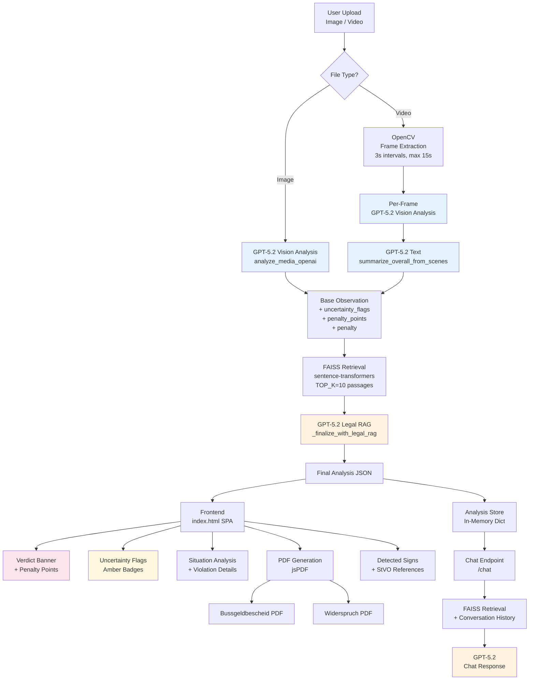

# StVO Traffic Inspector

AI-powered German traffic law analysis system that uses computer vision and legal RAG (Retrieval-Augmented Generation) to detect traffic violations, assess penalties, and generate formal documents.

## Authors

Nadeem Hakimi, Naweed Ohdah, Arnaud Bosselmann

## Features

- **Image & Video Analysis**: Upload dashcam photos or videos for automated StVO compliance checking
- **Vision AI (GPT-5.2)**: Detects traffic signs, violations, and environmental conditions in real-time
- **Legal RAG Pipeline**: Grounds all legal assessments in actual StVO and BKatV full-text passages via FAISS vector search
- **Penalty Calculation**: Estimates fines (EUR), Flensburg points, and driving bans per the German Bussgeldkatalog
- **Driving School Scoring (Fehlerpunkte)**: Penalty point system based on the German practical driving exam (1/3/5 points per error)
- **Uncertainty Detection**: Flags environmental factors (rain, fog, darkness, etc.) that reduce analysis reliability
- **Bilingual (DE/EN)**: Full German and English language support with dynamic switching
- **Chat Assistant**: Follow-up Q&A about the analysis with legal context
- **PDF Generation**: Penalty notices (Bussgeldbescheid) and objection letters (Widerspruch) as downloadable PDFs

## Application Architecture



### Data Flow Summary

```
1. User uploads media file (image or video)
2. Backend saves to uploads/ and determines file type
3. Vision analysis (GPT-5.2) produces:
   - Violation detection + severity
   - Detected traffic signs
   - Penalty estimation (fine, Flensburg points, driving ban)
   - Uncertainty flags (environmental factors)
   - Penalty points (driving exam scoring)
4. For video: frames extracted at 3s intervals, each analyzed, then aggregated
5. FAISS retrieves relevant StVO/BKatV legal passages
6. Legal RAG (GPT-5.2) refines the assessment with grounded legal references
7. Frontend renders: verdict banner, flags, situation text, violation details, signs
8. User can generate PDFs or chat with AI assistant for follow-up questions
```

## Tech Stack

| Layer                | Technology                                                   |
| -------------------- | ------------------------------------------------------------ |
| **Backend**          | Python 3, Flask                                              |
| **Vision AI**        | OpenAI GPT-5.2 (multimodal)                                  |
| **Legal AI**         | OpenAI GPT-5.2 (text reasoning)                              |
| **Vector Search**    | FAISS (facebook/faiss-cpu)                                   |
| **Embeddings**       | sentence-transformers (distiluse-base-multilingual-cased-v2) |
| **Video Processing** | OpenCV (cv2)                                                 |
| **Frontend**         | Vanilla JavaScript (ES6 classes), Tailwind CSS, HTML               |
| **Icons**            | Lucide Icons                                                 |
| **PDF Generation**   | jsPDF (client-side)                                          |
| **Legal Data**       | StVO + BKatV full-text with FAISS indexing                   |

## Project Structure

```
Traffic-Rules-Project/
|-- app.py                        # Flask backend: API endpoints, RAG pipeline, chat
|-- unimodel_analyzer.py          # GPT-5.2 vision analysis + video summarization
|-- config.ini                    # Configuration (OpenAI API key)
|-- build_legal_corpus.py         # Script to build FAISS index from legal HTML sources
|-- check_corpus.py               # Utility to verify corpus integrity
|-- requirements.txt              # Python dependencies
|
|-- templates/
|   +-- index.html                # Single-page frontend application (JS + Tailwind)
|
|-- rules/
|   |-- traffic_rules.json        # 1135+ violation rules with penalties (fallback source)
|   |-- signs.json                # Traffic sign database (~1200 signs)
|   +-- faiss/                    # FAISS indexes for rules
|       |-- title.index
|       |-- description.index
|       +-- keywords.index
|
|-- legal_sources/
|   |-- raw/
|   |   |-- StVO.html             # German traffic law full-text
|   |   +-- BKatV.html            # German penalty catalog full-text
|   |-- processed/
|   |   +-- legal_corpus.json     # Parsed legal text corpus (580+ passages)
|   +-- faiss/
|       |-- legal.index           # FAISS index for legal passages
|       +-- legal_meta.json       # Metadata for legal passages
|
+-- uploads/                      # Temporary upload storage
```

## Setup

### Prerequisites

- Python 3.10+
- An OpenAI API key with access to GPT-5.2 and GPT-5.2

### Installation

1. Clone the repository:

   ```bash
   git clone <repository-url>
   cd Traffic-Rules-Project
   ```

2. Install Python dependencies:

   ```bash
   pip install -r requirements.txt
   ```

3. Configure your OpenAI API key in `config.ini`:

   ```ini
   [openai]
   api_key = sk-your-key-here
   ```

4. Build the legal corpus (first-time setup):

   ```bash
   python build_legal_corpus.py
   ```

5. Run the application:

   ```bash
   python app.py
   ```

6. Open your browser at `http://localhost:5000`

## API Endpoints

### `POST /analyze`

Upload an image or video file for traffic analysis.

**Request**: `multipart/form-data` with a `file` field

**Response**:

```json
{
  "analysis_id": "uuid",
  "data": {
    "safety_score": 0-100,
    "violation_detected": true/false,
    "severity": "NONE|WARNING|CRITICAL|UNCLEAR",
    "violation_title": {"de": "...", "en": "..."},
    "violation_details": {"de": "...", "en": "..."},
    "situation_summary": {"de": "...", "en": "..."},
    "stvo_references": ["..."],
    "detected_signs": [...],
    "penalty": {...},
    "uncertainty_flags": [...],
    "penalty_points": {"total": int, "breakdown": [...]}
  },
  "proof_frame": "base64_image_or_null"
}
```

### `POST /chat`

Send follow-up questions about a completed analysis.

**Request**:

```json
{
  "analysis_id": "uuid",
  "message": "user question",
  "history": [...]
}
```

**Response**:

```json
{
  "reply": "AI response text"
}
```

## Scoring Systems

### Penalty Points (Fehlerpunkte) - Driving Exam

Based on the German practical driving exam scoring:

| Category                    | Points | Examples                                        |
| --------------------------- | ------ | ----------------------------------------------- |
| Leichter Fehler (minor)     | 1      | Slightly late signaling, hesitant driving       |
| Mittlerer Fehler (moderate) | 3      | No mirror check, insufficient distance          |
| Schwerer Fehler (serious)   | 5      | Running stop sign, red light, wrong-way driving |

Threshold: ~11 points indicates exam failure level.

### Legal Penalties (Bussgeldkatalog)

Separate from exam scoring, the system also estimates official penalties:

- **Fine (Bussgeld)**: 10-560+ EUR
- **Flensburg Points**: 0-2 points
- **Driving Ban (Fahrverbot)**: 0-3 months

## Uncertainty Flags

When environmental or visual factors reduce analysis reliability, the system displays warning flags:

| Flag           | Description                                   |
| -------------- | --------------------------------------------- |
| `heavy_rain`   | Heavy rain reducing visibility                |
| `snow`         | Snow or ice on road                           |
| `fog`          | Fog or mist                                   |
| `too_dark`     | Insufficient lighting                         |
| `glare`        | Sun glare or lens flare                       |
| `blocked_view` | Obstructed camera view                        |
| `motion_blur`  | Motion blur in image                          |
| `poor_quality` | Low image resolution or compression artifacts |

## Language Support

The application supports German (DE) and English (EN) with:

- Dynamic UI language toggle
- Bilingual analysis output (all text fields include both languages)
- Smart language detection in chat (auto-detects German umlauts and word patterns)
